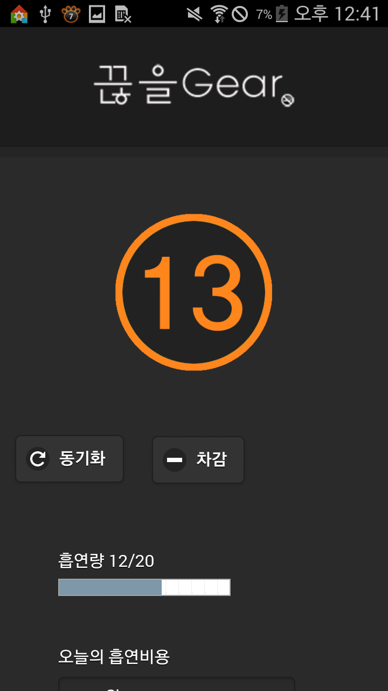

# 개요
2015 11월에 한국IT전문학교 교내 프로젝트 대회에서 최우수상을 수상한 어플입니다.

웨어러블 기기와 연동해서 흡연을 할 때 마다 버튼을 눌러 흡연량을 관리 할 수 있도록 만든 금연 도움 어플입니다.
기존 어플들은 흡연 후 어플을 열어 흡연량을 관리해야하는 부분이 사용자에게 귀찮음을 유발시키는 단점이 있는데
웨어러블 기기의 버튼을 두 번만 클릭해서 관리할 수 있게 만들어 이를 해결했습니다.

# 구현 기능
- 소셜 로그인 기능(네이버)
- 웨어러블 기기(갤럭시 워치)와 안드로이드 연동
- 일간 흡연량 및 흡연 비용 표시
- 주간 흡연량 대비 위험도 및 그래프 표시
- 금연 장려 포스터, TIP, 근처 보건소 표시
- 영문버젼

# 사용한 기술스택
- 하이브리드 앱 - HTML, CSS, JS(JQUURY)
- 웨어러블 어플 - Tizen
- 데이터베이스  - MySql

# 이미지

